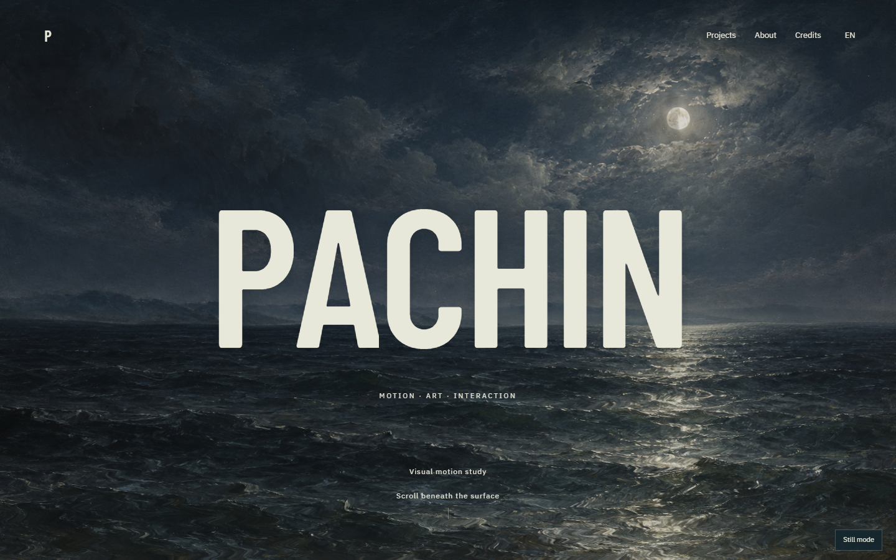

# Moonlit Tide — motion preview

An English-only preview of the PACHIN interactive ocean visual system. Personal copy and contact details are omitted. The `EN` language control is retained as a visual interface; additional languages are not published in this preview.

[View the live demo](https://pachin1919.github.io/moonlit-tide-motion-preview/)

The page moves from a painted moonlit sea into an interactive underwater particle field, then a dark two-layer exchange scene. It runs without a backend.

Open `index.html` through a local static server, or view the GitHub Pages deployment. The `?perf=1` query parameter enables the on-page performance readout.

Third-party notices are in [THIRD_PARTY_NOTICES.md](THIRD_PARTY_NOTICES.md). Artwork and site-specific code are not offered under an open-source license.
